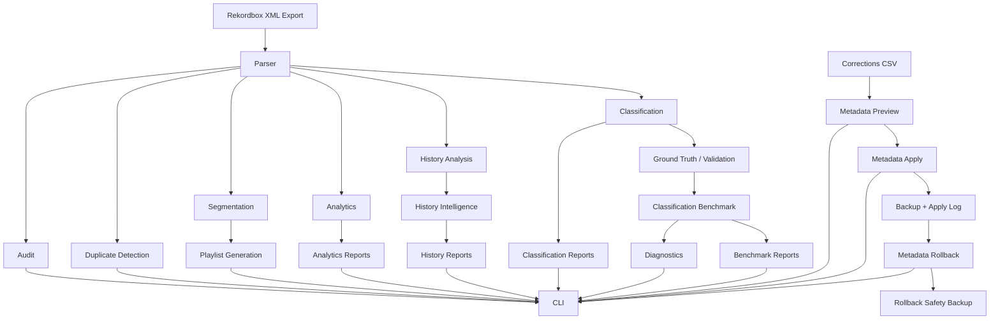
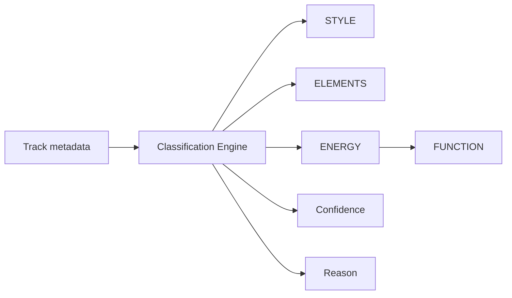

# Architecture

## Overview

Rekordbox Library Intelligence is a safety-first Python CLI application for analyzing exported Rekordbox XML libraries.

The project is intentionally designed around a simple boundary:

```text
Rekordbox
   │
   │ XML export
   â–¼
Rekordbox Library Intelligence
   │
   ├── read-only analysis
   ├── reports
   ├── classification
   ├── benchmark validation
   └── controlled metadata workflows
```

The application does **not** modify the Rekordbox database directly.

Most commands are read-only. Commands that can modify audio-file metadata are isolated behind explicit commands, confirmation flags, backups and logs.

---

## High-Level Architecture



---

## Design Goals

The architecture is guided by five principles.

### 1. Safety

Rekordbox library analysis should be non-destructive by default.

Read-only commands operate exclusively on exported XML data.

Metadata writes require an explicit workflow:

```text
Preview
   ↓
Apply with confirmation
   ↓
Backup
   ↓
Execution log
   ↓
Optional rollback
```

---

### 2. Separation of concerns

Parsing, analysis, classification, reporting and metadata modification are implemented as separate modules.

This keeps the CLI thin and allows core functionality to be tested independently.

---

### 3. Explainability

Classification does not return labels without context.

Predictions can include:

- label;
- confidence;
- reason.

The objective is to make automated suggestions understandable and reviewable by a DJ.

---

### 4. Reproducibility

Reports and benchmark outputs are deterministic for the same source data and configuration.

Ground-truth templates support seeded sampling for repeatable validation workflows.

---

### 5. Privacy

Real Rekordbox exports can expose:

- private filesystem paths;
- listening and performance history;
- library organization;
- personal validation labels.

Private source files, generated reports, backups and logs are excluded from version control.

Synthetic examples are used for repository tests and documentation.

---

# Application Layers

## CLI Layer

Main module:

```text
src/rekordbox_library_intelligence/cli.py
```

The CLI is the public entry point for the application.

Installed command:

```text
rekordbox-intelligence
```

The CLI is responsible for:

- argument parsing;
- command dispatch;
- user-facing output;
- confirmation requirements;
- output-path handling.

Business logic remains in dedicated modules whenever possible.

---

## Console Compatibility

Module:

```text
console.py
```

The CLI configures UTF-8 output streams for Windows compatibility.

This prevents failures when artist names or titles contain characters that cannot be represented by legacy Windows code pages.

The console layer is deliberately small and independent from analysis logic.

---

# Rekordbox Data Layer

## XML Parser

Module:

```text
parser.py
```

The parser converts Rekordbox XML data into Python structures consumed by the rest of the application.

Conceptually:

```text
Rekordbox XML
      ↓
 XML Parser
      ↓
 Track objects / library data
      ↓
 Analysis modules
```

The rest of the application should not need to understand XML parsing details.

This provides a stable internal boundary between Rekordbox export structure and application logic.

---

## Playlist Parsing

Module:

```text
rekordbox_playlists.py
```

This module handles Rekordbox playlist structures, including HISTORY playlists used as DJ-session data.

---

# Library Intelligence

## Audit

Module:

```text
audit.py
```

The audit layer detects library-quality issues such as:

- missing artist;
- missing title;
- missing BPM;
- low bitrate;
- never-played tracks.

The audit is read-only.

---

## Duplicate Detection

Module:

```text
duplicates.py
```

Duplicate detection identifies high-confidence duplicate candidates.

The module can compare available track metadata and usage signals to help determine which copy is the stronger retention candidate.

No files are deleted automatically.

---

## Segmentation

Module:

```text
segments.py
```

Segmentation organizes the library into operational DJ groups:

```text
CORE
ROTATION
DISCOVERY
UNASSIGNED
```

These classifications are designed to help a DJ understand library usage and prioritize tracks.

---

## Playlist Generation

Module:

```text
playlists.py
```

Segmentation results can be exported as M3U8 playlists.

The playlist generator references existing audio files and does not alter them.

---

# Analytics

## Library Analytics

Module:

```text
analytics.py
```

The analytics layer summarizes collection behavior.

Examples include:

- library utilization;
- DJ play counts;
- BPM distribution;
- rating distribution;
- top tracks;
- top artists.

---

## Analytics Reports

Module:

```text
reports.py
```

Analytics can be serialized into machine-readable files such as JSON and CSV.

This separates calculation from presentation and makes the output reusable in external analysis tools.

---

# Rekordbox HISTORY Intelligence

## Session Analysis

Module:

```text
history.py
```

Rekordbox HISTORY playlists are interpreted as DJ sessions.

Session-level metrics can include:

- track count;
- opening track;
- closing track;
- starting BPM;
- ending BPM;
- average BPM;
- minimum BPM;
- maximum BPM.

---

## Cross-Session Intelligence

Module:

```text
history_intelligence.py
```

This layer analyzes recurring behavior across HISTORY sessions.

Examples:

- repeated tracks;
- recurring openers;
- recurring closers;
- BPM patterns;
- transition patterns.

---

## HISTORY Reports

Module:

```text
history_reports.py
```

History intelligence can be exported to JSON and CSV for additional analysis.

---

# Classification Architecture

Classification is an implemented part of the application.

Main module:

```text
classification.py
```

The classification engine produces DJ-oriented attributes from available track metadata.

Current dimensions:

```text
STYLE
ELEMENTS
ENERGY
FUNCTION
```

---

## Classification Pipeline



Classification is intentionally explainable.

Each prediction can be associated with the rule or signal that produced it.

---

## ENERGY

ENERGY uses calibrated BPM ranges with optional semantic overrides.

Current model:

```text
BPM < 120        -> Warm
120 <= BPM < 123 -> Groove
123 <= BPM < 126 -> Lift
126 <= BPM < 129 -> Strong
BPM >= 129       -> Peak
```

Semantic terms can override BPM where a track has an explicit functional cue, for example:

```text
closer / closing / last call
reset / breakdown
```

The BPM boundaries were calibrated using real-library validation and then frozen rather than continually optimized against the same validation dataset.

---

## FUNCTION

FUNCTION uses a hierarchical decision model.

Highest priority:

```text
explicit semantic cues
```

Examples:

```text
opening / opener / intro -> Opener
bridge                   -> Bridge
singalong                -> Singalong
anthem                   -> Anthem
weapon                   -> Weapon
rescue                   -> Rescue
closing / closer         -> Closer
```

When no explicit semantic cue exists, contextual fallback can use ENERGY.

Examples:

```text
Warm   -> Opener
Peak   -> Weapon
Closer -> Closer
```

This structure prioritizes explicit intent over inferred context.

---

# Classification Outputs

## Classification Reports

Module:

```text
classification_reports.py
```

Classification predictions can be exported to CSV for review outside the CLI.

---

## Ground-Truth Template

Module:

```text
ground_truth_template.py
```

This module creates reproducible samples that can be manually labeled.

Seeded sampling allows the same validation subset to be regenerated.

---

## Rekordbox Ground Truth

Module:

```text
rekordbox_ground_truth.py
```

Structured Rekordbox `Grouping` metadata can be converted into validation labels.

Important architectural boundary:

```text
Grouping -> Ground Truth
```

but not:

```text
Grouping -> Classifier Input
```

This prevents direct target leakage.

---

# Benchmark Architecture

## Classification Benchmark

Module:

```text
classification_benchmark.py
```

The benchmark compares classifier predictions with validation labels.

It measures:

- evaluated tracks;
- predictions present;
- missing predictions;
- correct predictions;
- incorrect predictions;
- coverage;
- accuracy.

---

## Diagnostics

Module:

```text
classification_diagnostics.py
```

Diagnostics aggregate mismatch patterns to expose systematic classification errors.

This supports model calibration without hiding where errors occur.

---

## Track-Level Mismatches

Module:

```text
classification_mismatches.py
```

Track-level mismatch output allows individual classification errors to be inspected.

This is useful for separating:

- boundary problems;
- metadata problems;
- exceptional tracks;
- possible ground-truth inconsistencies.

---

## Benchmark Reports

Module:

```text
benchmark_reports.py
```

Benchmark results can be exported in reproducible formats.

Current outputs include:

```text
benchmark_summary.json
energy_mismatches.csv
function_mismatches.csv
```

This allows benchmark results to be inspected outside the CLI and compared between future versions.

---

# Metadata Architecture

Metadata modification is intentionally separated from analysis.

## Preview

Module:

```text
metadata.py
```

Corrections can be previewed before any audio file is changed.

---

## Apply

Module:

```text
metadata_apply.py
```

Applying metadata changes requires explicit confirmation.

The workflow creates backups and records an execution log.

Conceptually:

```text
Corrections CSV
      ↓
Validation
      ↓
Backup original file
      ↓
Write metadata
      ↓
Record result in log
```

---

## Rollback

Module:

```text
metadata_rollback.py
```

Rollback restores metadata based on a previous apply log.

Before rollback, the currently modified state is also preserved as a safety backup.

Conceptually:

```text
Apply log
    ↓
Safety backup of current state
    ↓
Restore previous metadata
    ↓
Rollback log
```

This creates a reversible metadata workflow instead of a one-way bulk edit.

---

# Safety Boundaries

The architecture separates operations into two broad categories.

| Layer | Examples | Modifies audio files |
|---|---|---:|
| Read-only intelligence | audit, duplicates, analytics, history, classification, benchmarks | No |
| Metadata workflow | metadata-apply, metadata-rollback | Yes |

Even metadata commands do not modify the Rekordbox database itself.

---

# Output Architecture

Generated runtime artifacts are placed under:

```text
output/
```

Examples:

```text
output/
├── benchmarks/
├── classification/
├── ground_truth/
├── metadata_backups/
└── ...
```

Generated private data is intentionally excluded from Git.

The repository keeps only safe synthetic examples required for testing and documentation.

---

# Testing Architecture

Tests are located under:

```text
tests/
```

The suite covers:

- XML parsing;
- audit;
- duplicate detection;
- segmentation;
- playlist generation;
- analytics;
- HISTORY analysis;
- HISTORY intelligence;
- report generation;
- classification;
- classification diagnostics;
- classification benchmarks;
- ground truth;
- metadata apply;
- metadata rollback;
- console encoding;
- CLI integration.

The production modules are structured so that most functionality can be tested independently of the CLI.

---

# Source Layout

```text
src/
└── rekordbox_library_intelligence/
    ├── analytics.py
    ├── audit.py
    ├── benchmark_reports.py
    ├── classification.py
    ├── classification_benchmark.py
    ├── classification_diagnostics.py
    ├── classification_mismatches.py
    ├── classification_reports.py
    ├── cli.py
    ├── console.py
    ├── duplicates.py
    ├── ground_truth_template.py
    ├── history.py
    ├── history_intelligence.py
    ├── history_reports.py
    ├── metadata.py
    ├── metadata_apply.py
    ├── metadata_rollback.py
    ├── parser.py
    ├── playlists.py
    ├── rekordbox_ground_truth.py
    ├── rekordbox_playlists.py
    ├── reports.py
    └── segments.py
```

---

# Architectural Decisions

## Why exported XML instead of the Rekordbox database?

Direct database modification would create unnecessary risk and stronger coupling to Rekordbox internals.

Using exported XML provides:

- a safer integration boundary;
- reproducible input;
- easier testing;
- easier debugging;
- no dependency on undocumented database writes.

---

## Why rule-based classification?

For the current scope, explainable rules provide several advantages:

- predictions can be understood by the DJ;
- behavior can be benchmarked directly;
- calibration decisions remain visible;
- no external model service is required;
- the system can operate locally.

Future versions may explore richer models, but explainability and validation should remain requirements.

---

## Why keep benchmark data outside the repository?

The main validation dataset comes from a real personal DJ library.

Keeping it private avoids exposing:

- local file paths;
- personal collection details;
- historical usage;
- manually organized metadata.

Synthetic examples provide public reproducibility without publishing the private collection.

---

## Why separate benchmark diagnostics from classification?

The classifier should produce predictions.

Benchmark and diagnostics modules should evaluate those predictions.

Keeping these responsibilities separate prevents validation logic from becoming part of the production classifier and reduces the risk of accidental target leakage.

---

# Current Architecture Status

Implemented:

```text
XML parsing
Audit
Duplicate detection
Segmentation
Playlist generation
Analytics
Analytics reports
HISTORY session analysis
HISTORY intelligence
HISTORY reports
STYLE classification
ELEMENTS classification
ENERGY classification
FUNCTION classification
Classification reports
Ground-truth templates
Rekordbox Grouping ground truth
Classification benchmark
Mismatch diagnostics
Benchmark reports
Metadata preview
Metadata apply
Metadata rollback
Windows UTF-8 console handling
CLI integration
Automated tests
```

Planned improvements are intentionally focused on validation, automation and presentation rather than expanding the core feature set without evidence.

Potential future work includes:

- independent validation datasets;
- additional DJ transition analytics;
- visualization dashboards;
- richer playlist recommendation models;
- support for additional library export formats.
